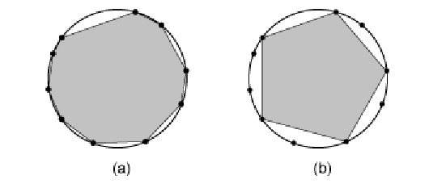

# Shrinking Polygons  

  ** Context **

  _ A polygon is said to be inscribed in a circle when all its vertices lie on that circle. In this problem you
will be given a polygon inscribed in a circle, and you must determine the minimum number of vertices
that should be removed to transform the given polygon into a regular polygon, i.e., a polygon that is
equiangular (all angles are congruent) and equilateral (all edges have the same length).
When you remove a vertex v from a polygon you rst remove the vertex and the edges connecting it
to its adjacent vertices w1 and w2, and then create a new edge connecting w1 and w2. Figure (a) below
illustrates a polygon inscribed in a circle, with ten vertices, and gure (b) shows a pentagon (regular
polygon with ve edges) formed by removing ve vertices from the polygon in (a). _

_ In this problem, we consider that any polygon must have at least three edges. _

  ## Input
The input contains several test cases. The rst line of a test case contains one integer N indicating the
number of vertices of the inscribed polygon (3 <= N <= 10^4 ). The second line contains N integers Xi
separated by single spaces (1 <= Xi <= 10^3, for 0 <= i <= N - 1). Each Xi represents the length of the arc
dened in the inscribing circle, clockwise, by vertex i and vertex (i + 1) mod N. Remember that an
arc is a segment of the circumference of a circle; do not mistake it for a chord, which is a line segment
whose endpoints both lie on a circle.
The end of input is indicated by a line containing only one zero.
  
  ## Output

For each test case in the input, your program must print a single line, containing the minimum number
of vertices that must be removed from the given polygon to form a regular polygon. If it is not possible
to form a regular polygon, the line must contain only the value `-1'.

  ## Sample Input
3

1000 1000 1000

6

1 2 3 1 2 3

3

1 1 2

10

10 40 20 30 30 10 10 50 24 26

0

  ## Sample Output
0

2

-1

5

  